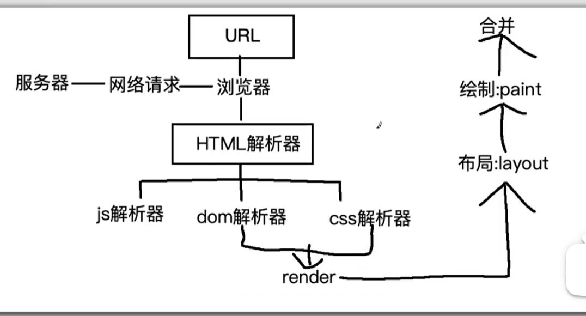

#### 第一题：介绍一下css的盒子模型

~~~
css的盒子模型：标准盒子模型，IE盒子模型
标准盒子模型：margin、border、padding、content
IE盒子模型：margin、content（border+padding+content）
通过css转换盒子模型:
box-sizing:content-box  //标准盒子模型
box-sizing：border-box  //IE盒子模型
~~~

#### 第二题：line-height和height区别

~~~	
line-height是每一行文字的高，如果文字换行则整个盒子高度会增大（行数*行高）
height是一个死值，就是这个盒子的高度不会变
~~~

#### 第三题:css选择符有哪些？哪些属性可以继承？

~~~	
css选择符
通配（*）
id选择器（#）
类选择器（.)
标签选择器（div、p、h1...）
相邻选择器（+）
后代选择器（ul li）
子元素选择器（>)
属性选择器（a[href]）
css属性哪些可以继承：
文字系列：font-size、color、line-height.....
***不可继承属性：border、padding、margin....
~~~

#### 第四题：CSS优先级算法如何计算

~~~	
优先级比较：！important>内联样式>id>class>标签>通配
~~~

~~~	
CSS权重计算：
第一：内联样式（style）  权重值：1000
第二：id选择器     权重值：100
第三：类选择器   权重值：10
第四：标签&伪元素选择器   权重值：1
第五：通配、>、+       权重值：0
~~~

#### 第五题：用CSS画一个三角形

~~~	
主要用border属性
首先搞一个div盒子
然后设置高度和宽度为0
之后如果想画左三角形，就把左边框不设置透明，其他都设置透明，依次类推右三角形，上三角形也是这样的
~~~

#### 第六题：一个盒子不给宽度和高度如何水平垂直居中？

~~~	
第一种方法：用flex布局，给父元素添加justify-content：center，align-items：center

  </head>

  <body>
    

      
main

    

  </body>

~~~

~~~	
第二种方法：子绝父相，left：50%    top：50%
 
  </head>

  <body>
    

      
main

    

  </body>
~~~

#### 第七题：display有哪些值？说明他们的作用？

~~~	
none： 隐藏元素
block： 把某某元素转换成块元素
inline:   把某某元素转换成内联元素
inline-block：把某某元素转换成行内块元素
~~~

#### 第八题：对BFC规范（块级格式化上下文：block formatting context）的理解

~~~
1.了解BFC:块级格式化上下文
2.BFC的原则：如果一个元素具有BFC，那么内部元素再怎么弄，都不会影响到外面的元素
3.如何触发BFC:
float的值非none
overflow的值非visible
display的值为：inline-block、table-cell
position的值为：absolute、fixed
~~~

#### 第九题：清除浮动有哪些方式？

~~~	
1.触发BFC
2.多创建一个盒子，添加样式：clear：both
3.after方式
  ul:after{
      content：' ';
      display：block;
      clear：both
  }
~~~

#### 第十题：在网页中的应该使用奇数还是偶数的字体？为什么呢？

~~~	
偶数：让文字在浏览器上表现更好看

另外说明：ui给前端一般设计图都是偶数的，这样不管是布局也好，转换px也好，方便一点
~~~

#### 第十一题：有几种定位（？分别是根据什么定位的？

~~~	
static（默认） 没有定位
fixed：固定定位,相对于浏览器窗口（可视窗口）进行定位
relative：相对于自身定位不脱离文档流
absolute：相对于第一个有relative的父元素，脱离文档流（子绝父相）
relative和absolute区别
1.relative不脱离文档，absolute脱离文档
2.relative相对于自身，absolute相对于第一个有relative的父元素
3.relative如果有left、right、top、bottom那么只显示left和top的效果
absolute如果有left、right、top、bottom那么都会产生效果

~~~

#### 第十二题：写一个左中右布局占满屏幕，其中左、右俩块固定宽200，中间自适应宽，要求先加载中间块，请写出结构及样式。

~~~	
双飞翼布局

~~~

#### 第十三题：什么是CSS reset？

~~~	
reset.css ：是一个css文件，用来重置css样式的（现在用的很少，主要是太耗费性能）
Normalize.css:为了增强跨浏览器渲染的一致性，一个css重置样式库（几乎一致）
~~~

#### 第十四题：css sprite是什么，有什么优缺点

~~~
1.是什么
  把多个小图标合并成一张大图片
 2.优缺点
 优点：减少了http请求的次数,提升了性能
 缺点：维护比较差（例如图片位置进行修改或者内容宽高修改）
~~~

第十五题：display：none与visibility：hidden的区别

~~~	
1.占用位置的区别：
display:none      是不占用位置的
visibility：hidden    虽然隐藏了，但是占用位置
2.重绘和回流的问题
两个都会造成重绘，display：none还会产生一次回流（结构改变，位置改变）
~~~

第十六题：opacity和rgba区别：

~~~	
共同性：实现透明效果
1.opacity 取值范围0到1之间，0表示完全透明,1表示不透明
2.rgba   R表示红色,G表示绿色,B表示蓝色,取值可以在正整数或者百分数。A表示透明度取值0到1之间
区别：
opacity会继承父元素的opacity属性,
而RGBA设置的后代元素不会继承不透明属性
~~~

