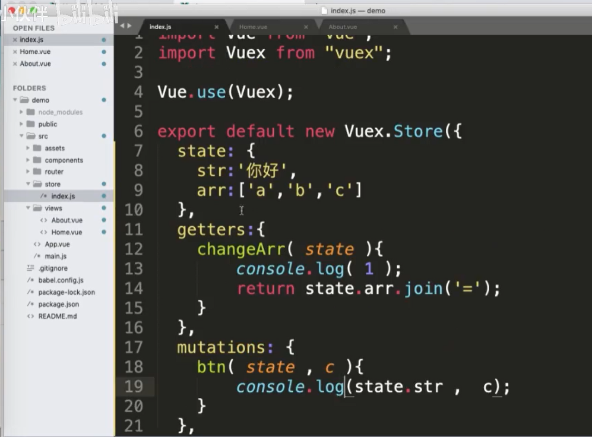

#### 1.什么是渐进式框架

vue.js  router vuex element ...插件

vue.js 渐0 router 渐1 vuex 渐2   一点点扩大

#### 2.vue2.x生命周期

1.有哪些生命周期系统自带：（8个）

beforeCreate

created

beforeMount

mounted

beforeUpdate

updated

beforeDestory

destroyed

2.一旦进入到页面或者组件，会执行哪些生命周期，顺序

beforeCreate

created

beforeMount

mounted

3.在哪个阶段有$el,在哪个阶段有$data

beforeCreate 啥也没有

created 有data没有el

beforeMount 有data没有el

mounted 都有

4.如果加入了keep-alive会多两个生命周期

activated、deactivated

5..如果加入了keep-alive，第一次进入组件会执行哪些生命

beforeCreate

created

beforeMount

mounted

activated

6.如果加入了keep-alive的了解，第二次或者第N次进入组件会执行哪些生命周期？

只执行了一个生命周期： activated

#### 3.谈谈你对keep-alive的了解

1.是什么

vue系统自带的一个组件，功能：用来缓存组件的==>提升性能

2.使用场景

就是来缓存组件，提升项目性能，具体实现比如：首页进入到详情页，如果用户在首页每次点击都是相同的，那么详情页就没必要请求N次了,直接缓存就可以了，当然如果点击的不是同一个，那么就直接请求

#### 4.v-if 和v-show区别

1.展示形式不同

v-if是 创建一个dom节点

v-show是display：none、block

2.使用场景不同

初次加载v-if要比v-show好，页面不会做加载盒子

频繁切换v-show要比v-if好，创建和删除的开销太大了，显示和隐藏开销较小

#### 5.v-if 和 v-for优先级

v-for的优先级要比v-if高

从源码中可以体现出来

#### 6.ref是什么

来获取dom的

#### 7.nextTick是什么

先同步后异步 所以为1234

获取更新后的dom

#### 8.scoped原理

1.作用：让样式在本组件中生效,不影响其他组件

2.原理：给节点新增自定义属性，然后css根据属性选择器添加样式

#### 9.Vue中如何做样式穿透

一、让css只在当前组件生效

<style scoped>

二、scss、stylus

scss：

​	1.下载

​		npm install sass-loader node-sass --save

​	2.

​		<style lang='scss'  scoped>

​	3.scss 样式穿透

​		父元素 /deep/ 子元素

#### 10.vue组件之间如何传值通信

##### 1.父组件传值子组件

父组件：

<Header :msg='msg'></Header>

子组件：

​	props：[' msg']

​	props：{

​		msg：数据类型

}

##### 2.子组件传值父组件

子组件：

​		this.$emit("自定义事件名称",要传的数据)

父组件：

<Header @childInput='getVal'></Header>

methods：{

​    getVal（msg）{

​		//msg就是子组件传递的数据

}

}

##### 3.兄弟组件之间的传值

   通过一个中转（bus）

A兄弟传值：

​	import bus from '@/common/bus'

​	bus.$emit('toFooter',this.msg)

B兄弟接收

import bus from ‘ @/common/bus’

bus.$on（'toFooter',（data）=>{

   //data是this.msg的数据

​		this.str = data

}

#### 11.computed、methods、watch有什么区别

（1）computed vs methods区别

​	computed是有缓存的，methods没有缓存

（2）computed vs watch区别

​         watch是监听数据或者路由发生了改变才可以响应（执行）

​	computed计算某一个属性的改变，如果某一个值改变了计算属性会监听到进行返回

​       watch是当前监听到的数据改变了，才会执行内部代码

#### 12.props和data优先级谁高

props ===> methods ===> data ===> computed ===> watch

#### 13.Vuex有哪些属性

state、getters、mutations、actions、modules

state：类似于组件中data，存放数据

getters：类似于组件中computed

mutations：类似于组件中methods

actions：提交mutations的

modules：把以上4个属性再细分，让仓库更好管理

#### 14.Vuex是单向数据流还是双向数据流

vuex是单向数据流

#### 15.Vuex中的mutaioons和actions区别

mutations：都是同步事务（一个变另外一个不变）

actions：可以包含任意异步操作（一个变另外一个也变）

在vue调试中可以看出来

#### 16.Vuex如何做持久化存储

Vuex本身不是持久化存储

1.使用localStorage自己写

2.使用vuex-persist插件

vue设置代理解决跨域问题

#### 17.Vue项目打包上线

1.自测==>修改路由模式

2.代理不生效，使用ENV

3.修改路径

#### 18.Vue路由模式

路由模式有两种:history ,hash

区别：

1表现形态不同

​     history：http：//localhost：8080/about

​     hash：http：//localhost：8080/#/about

2.跳转请求

​	history：http：//localhost：8080/id  ===>发送请求

​         hash：不会发送请求

3.打包后前端自测要使用hash，如果使用history会出现空白页

#### 19.介绍一下SPA以及SPA有什么缺点

SPA是什么？

单页面应用

缺点：

1.SEO优化不好

2.性能不是特别好

#### 20.Vue路径传值

1.显式                                                                                                      

http://localhost:8080/about?a=1

1.1传：this.$router.push（{

​		path：‘/about’,

​		query：{

​				a：1

}

}）

1.2接：this.$route.query.a

2.隐式

http://localhost:8080/about

2.1 传：

this.$router.push（{

​		path：‘About’,

​		query：{

​				a：1

}

}）

2.2接：this.$route.params.a

#### 21.路由导航守卫有哪些

全局、路由独享、组件内

1.全局

beforeEach、beforeResolve、afterEach

2.路由独享

beforeEnter

3.组件内

  beforeRouteEnter、beforeRouteUpdate、beforeRouteLeave

使用场景：判断是否登录,如果登录就next否则就跳转到登陆页面

22.Vue动态路由

场景：详情页（文章、商品）

router.js配置

~~~js
{
    path：”/list“,
     name：‘List’,
        children：[
        {
            path：‘/list/：id’,
            name：‘Details’,
            component：（）=>
            	import（‘../view/Details.vue’），
            
        }
    ]   ，
           component：（）=>
            	import（‘../view/List.vue’），

}
~~~

